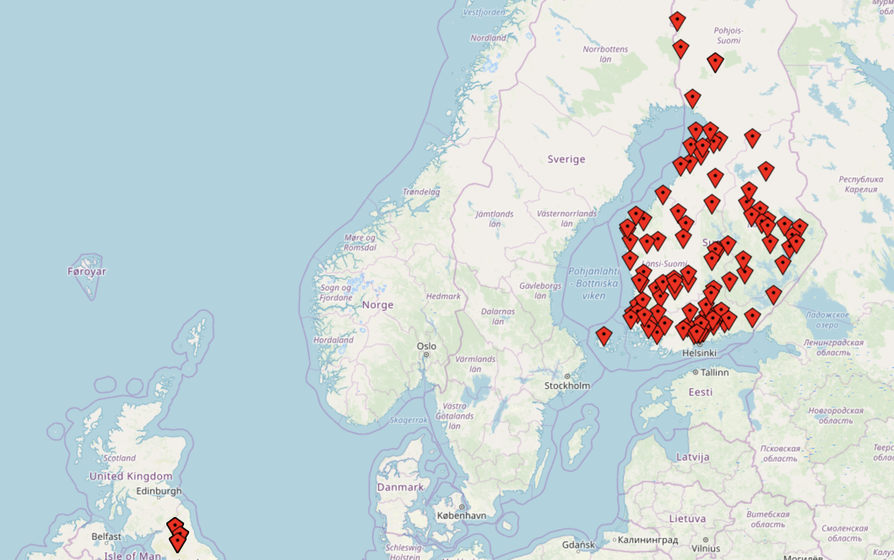

## Open Bank API client implemented with Spring Boot
This is a technology demonstration of the OBP API capabilities. It puts all available bank branches in the `https://apisandbox.openbankproject.com` sandbox on a map.
The OBP Client API is using Spring Boot 2.1.x and needs JDK 10.



## Setup and run
Sign-up at the OBP sandbox: https://apisandbox.openbankproject.com/ Note the consumer key, username and password.
Then edit `/src/main/resources/application.properties` and paste the consumer key above as the `obp.consumerKey` value.  
 
The standard command ```./gradlew bootRun``` will start a Tomcat container running on port 8080. Open a browser and browse to http://localhost:8080
To login, use the username and password. After a successful login, a map with all available branches present in the `apisandbox` will be displayed.
Only a small subset of the full API capabilities are integrated in the webapp (banks, branches). 

# OBP Java API
The OBP REST API is made available as a native Java API by the com.tesobe.obp.clientapi.*ApiClient classes. Accounts and transactions are available as many other OBP API capabilities. See the integration test suite for example usage.
Caveat: currently, not all of the REST API implemented. 

## Code organization
 
 The code is organized between main and test directories. The tests are covering the following functionality:
  - Authentication
  - Get account details
  - Get transactions for an account
  - Tag transactions
  - Add geolocation to transaction
 
## Dependencies
 
The single external dependency is on a live OBP sandbox that needs to run in order for the tested functionality to be successful. This sample project is using the version 2.2.0 of the OBP API. It shouldn't be difficult to use a different API version with the caveat that some of the entities must be adapted to match the data in the target API version.
 
The OBP client API is abstracted via [Feign](http://projects.spring.io/spring-cloud/spring-cloud.html#spring-cloud-feign), a declarative REST client. See [ObpApiClient](src/main/java/com/tesobe/obp/api/ObpApiClient.java) and [DirectAuthenticationClient](src/main/java/com/tesobe/obp/api/DirectAuthenticationClient.java) for implementation details.
 
Internally, the project is also using Lombok to simplify the code and the Joda Money API for representing monetary values. 
 
## Test and build
 
 Run all tests with:
 ```./gradlew clean build```
 
There is a fat jar build as well, available under `build/libs` that can be executed with `java -jar obp-api-client.jar`